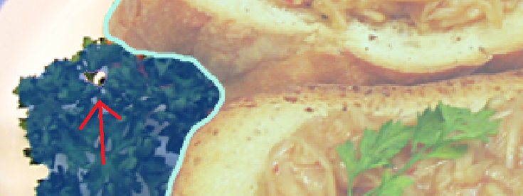

# :arrows_counterclockwise: Masks (with holes) exporter to COCO JSON annotation format

Supports:
- Masks in Image/PNG format ->  COCO JSON format (RLE or Polygon) for multi-class Instance Segmentation.

This exporter is a bit special in a sense that it **preserves holes** in the custom binary masks and, thus,
creates COCO JSON annotations files that **consider holes in different objects/instances.**

Even though the original COCO annotations format DOES NOT take into consideration the holes in the objects, you can export other datasets in COCO format, such that holes ARE taken into consideration.

This is achieved by exporting the masks in uncompressed RLE format, where is the case for possible holes (multiple contours in the mask of a specific class from the image). 
Otherwise, masks are still exported into polygons. Different from original COCO, the RLE format is not ONLY used for "is_crowd" instances, but for other instances too. 

More than this:
- It supports multiple formats of masks (see `main.py` CLI args)
- Offers testing and visualization of exported annotations
- Provides function for converting from binary to uncompressed RLE and from uncompressed RLE to compressed RLE
- It is easily extendable

Example of resulted exportation VS original mask:
 
## :gear: Installation
```bash
pip install -r requirements.txt
```

## :file_folder: Code structure
```
├───data
│   └───<YOUR_DATASETS_DIRECTORIES_HERE>
├───tools
│   ├───datasets.py
│   ├───utils.py
│   └───exporter.py
└───main.py

```

## :notebook: Custom dataset
The current implementation provides exporter only for UECFOODPIXCOMPLETE dataset, but you can very easily create a custom exporter by:
- in `datasets.py`, inherit `BaseExporter` and override `get_classes_names_ids()` method
- importing your custom exporter in main.py

```bash
class MyExporter(BaseExporter):

    def __init__(self, img_path, ann_path, cat_file_path, output_ann_path, split, mask_channel, ext_ann=".png",
                 ext_img=".jpg", palette=None):
        super().__init__(img_path, ann_path, cat_file_path, output_ann_path, split, mask_channel, ext_ann,
                         ext_img, palette)


    def _get_classes_names_ids(self):
    """
    Creates class_ids and class_names arrays, according to a specific mapping, 
    stored in a file (or somewhere else).
    """
       <YOUR CODE>
       # Here you could exclude a class, for example background from annotations, if you wish
       
       return class ids, class names
```

## :zap: Functionalities and usage
The main functionalities (self-explainable) are:
- `exporter.export(filter_area)`
- `exporter.save()`
- `check_export_results()`

In `main.py` you will find instructions about the usage by reading the CLI arguments details. Also, a step by step code that uses all the functionalities is provided.

For UECFOODPIXCOMPLETE, here is an example of program call:
```bash
python main.py data/UECFOODPIXCOMPLETE/data/UECFoodPIXCOMPLETE/train/img/ 
               data/UECFOODPIXCOMPLETE/data/UECFoodPIXCOMPLETE/train/mask/ 
               data/UECFOODPIXCOMPLETE/data/category.txt 
               data/UECFOODPIXCOMPLETE/ 
               train 
               2 
               --masks_output_path output/
               --cats []
```

The exporter will create an `annotations` directory with 2 JSON files, one for `train` and one for `val`, exactly like in COCO format.
```
├───data
│   └───<YOUR_DATASET>
│       ├─── ...
│       └───annotations
│           ├───instances_val2017.json
│           └───instances_train2017.json
```
You can easily use your dataset as a CustomClass that perfectly mimics COCO (only the classes and the palette are different).

## :clipboard: Notes
Please read the description of `mask_channel` CLI argument and make sure you understand the mask options and the color palette.

## TODOs
- [ ] Support base formats other than masks
- [ ] Add more datasets
